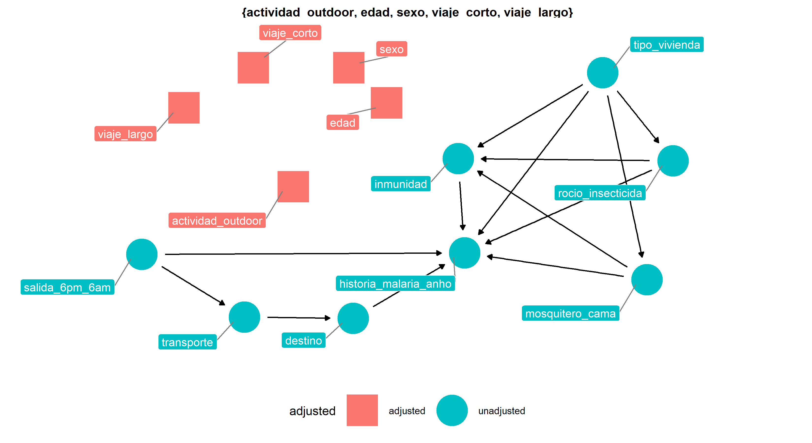
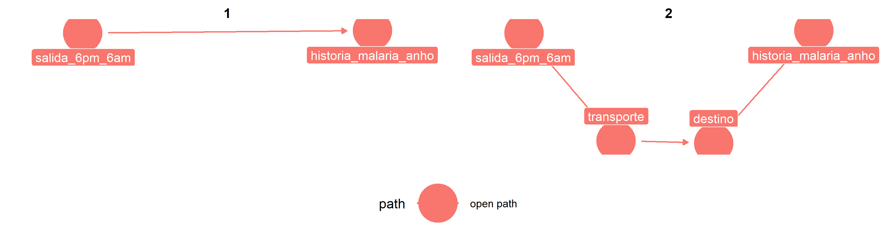
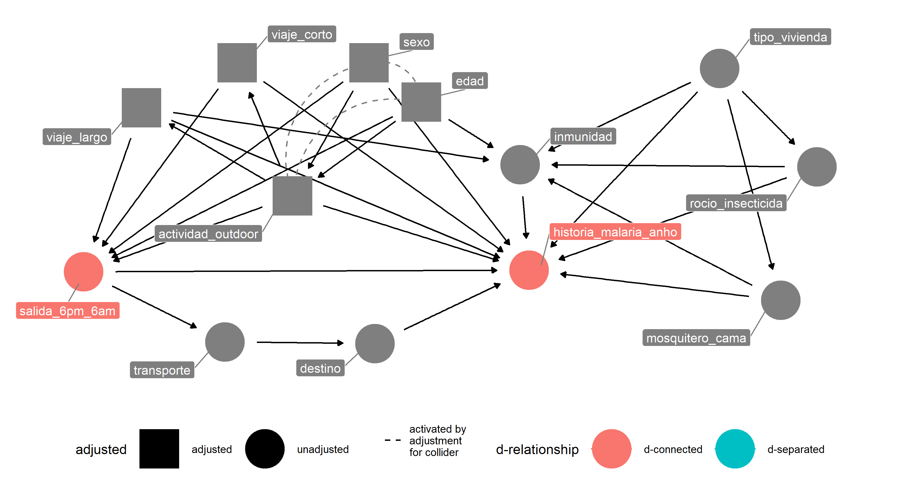

---
output:
  md_document:
    variant: markdown_github
---

# MSc thesis project

# Main question

## Do human mobility is associated with malaria history during the last year at periurban communities?

# DAG

## variables

## adjustment

## open causal paths

## d-connected variables

# Contact

Andree Valle Campos

__twitter/github:__ [@avallecam](https://twitter.com/avallecam)

__mail:__ avallecam@gmail.com
