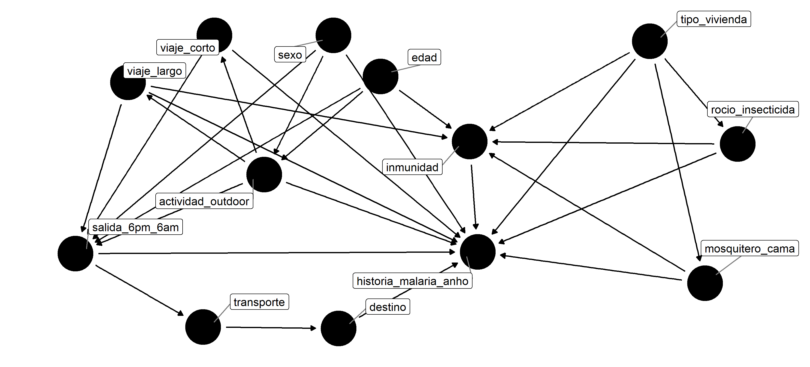
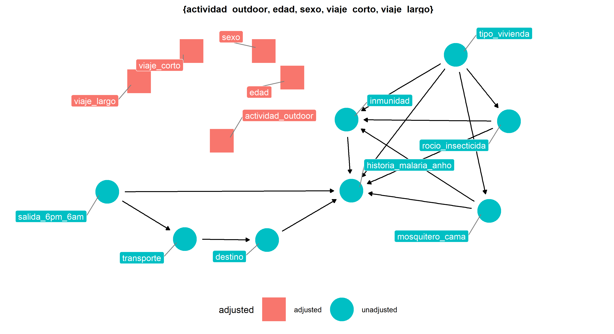
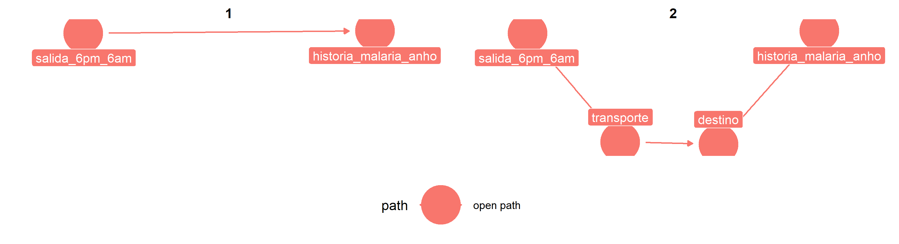

ASTMH poster PDF link [here](https://github.com/avallecam/movmal/blob/master/poster/astmh_poster-ValleAA-20191118.pdf)
======================================================================================================================

Contact
=======

Andree Valle Campos

**twitter/github:** [`@avallecam`](https://twitter.com/avallecam)

**mail:**
<a href="mailto:avallecam@gmail.com" class="email">avallecam@gmail.com</a>

------------------------------------------------------------------------

MSc thesis project
==================

Main question
=============

Do human mobility is associated with malaria history during the last year at periurban communities?
---------------------------------------------------------------------------------------------------

DAG
===

variables
---------

adjustment
----------

open causal paths
-----------------

d-connected variables
---------------------

------------------------------------------------------------------------

Contact
=======

Andree Valle Campos

**twitter/github:** [`@avallecam`](https://twitter.com/avallecam)

**mail:**
<a href="mailto:avallecam@gmail.com" class="email">avallecam@gmail.com</a>
